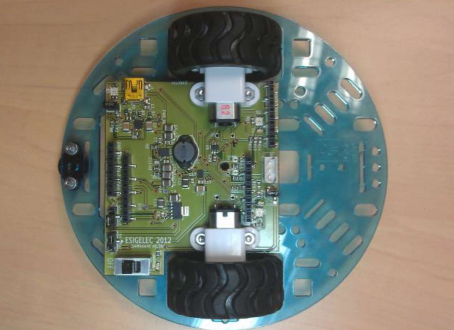
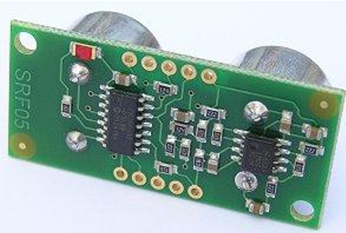
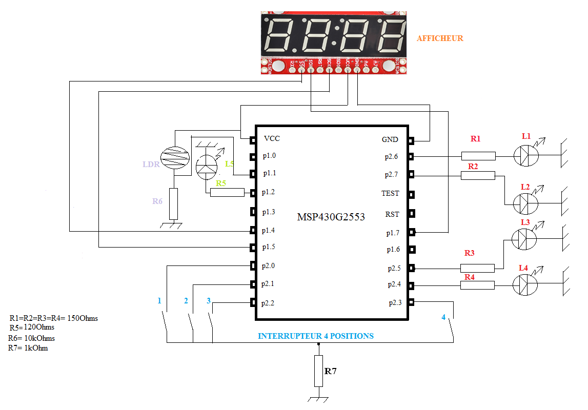

# 🏎️ Robot Autonome Suiveur de Ligne & Évitement d'Obstacle

## 📖 Le Projet 
Ce projet consiste en la conception et le développement d'un **robot mobile autonome** intelligent basé sur le microcontrôleur **Texas Instruments MSP430G2553**. 

Sa mission principale est de suivre une ligne blanche au sol de manière fluide à l'aide de capteurs infrarouges, tout en surveillant son environnement en temps réel. Grâce à une gestion dynamique des priorités, le robot exécute un arrêt d'urgence immédiat dès qu'un obstacle franchit le seuil critique de sécurité (fixé à 20 cm). Dès que la trajectoire est libérée et que l'obstacle est retiré, le robot reprend instantanément et automatiquement sa navigation et son suivi de ligne.

---

## 📸 Galerie du Projet

Voici l'architecture matérielle globale du système :

| Le Robot Mobile | Le Capteur Ultrason SRF05 | La Carte d'Extension |
| :---: | :---: | :---: |
|  |  |  |
| *Vue d'ensemble du châssis et de l'intégration finale.* | *Module de précision utilisé pour le calcul du temps de vol.* | *Shield électronique d'interface pour le MSP430.* |

---

## 🛠️ Périmètre du projet & Contributions

Ce robot a été réalisé dans un cadre collaboratif. Afin de valoriser uniquement mon travail personnel et de respecter la propriété de chacun, ce dépôt Git contient exclusivement les fichiers que j'ai conçus et implémentés avec ma binôme :

* **`detection_obstacle.c` / `.h` :** Mon travail principal. Conception complète du pilote pour le capteur ultrason SRF05 (configuration du Timer_A1 en mode Capture synchrone sur fronts montants et descendants, écriture de la routine d'interruption ISR et calcul de la distance en centimètres).
* **`main.c` :** Écriture de la boucle de contrôle principale (machine à états), gestion de la reprise automatique après arrêt et intégration de la logique de sécurité prioritaire.
* **`ADC.c` / `.h` :** Configuration du convertisseur analogique-numérique (fourni par l'école, inclus pour assurer la cohérence des appels de lecture dans la boucle principale).

*Note : Les briques logicielles liées à la génération des signaux PWM pour les moteurs (pont en H) ainsi que l'algorithme de traitement des capteurs infrarouges de suivi de ligne ont été développés par d'autres binômes de l'équipe et ont été exclus de ce dépôt.*

---

## ⚙️ Architecture Matérielle & Choix Techniques

Le développement a été réalisé en **C Bare-Metal** afin d'optimiser l'utilisation des ressources du MSP430G2553 (Fréquence d'horloge CPU/SMCLK configurée à 1 MHz).

### 1. Pilote du Capteur Ultrason (SRF05)
Le fonctionnement repose sur une gestion rigoureuse des périphériques internes du microcontrôleur pour libérer le temps de calcul du processeur :
* **Déclenchement (Trigger - P1.1) :** Envoi d'un signal d'amorçage calibré à 10 $\mu$s à l'aide de la fonction intrinsèque `__delay_cycles(10)`. Le SRF05 génère ensuite une salve interne de 8 impulsions ultrasoniques à 40 kHz.
* **Mesure du Retour (Echo - P2.1) :** Câblé en mode double broche standard (broche Mode/OUT du capteur non connectée). La broche `P2.1` est configurée en fonction alternative matérielle connectée au bloc de capture du **Timer_A1** (`TA1.1` / `CCI1A`).
* **Capture par Interruption (`TIMER1_A1_VECTOR`) :** Le matériel effectue une "photographie" automatique du compteur du Timer à chaque changement d'état de la ligne Echo (front montant puis descendant). Le calcul du delta de temps en microsecondes ($t_{descente} - t_{montee}$) permet d'obtenir la distance physique via la formule :
$$\text{Distance (cm)} = \frac{\Delta t}{58}$$

### 2. Machine à États, Priorisation et Reprise (Main)
La boucle principale orchestre la scrutation des capteurs. La sécurité est traitée comme une priorité absolue et dynamique : 
* **Si un obstacle est présent (< 20 cm) :** La fonction `verifier_chemin()` lève l'état `OBSTACLE_DETECTE`, la commande d'arrêt moteur `stop()` est immédiatement invoquée et la boucle de navigation (suivi de ligne) est court-circuitée via l'instruction `continue`.
* **Dès que l'obstacle est enlevé :** L'état repasse à la normale, l'instruction de blocage saute, et le robot reprend instantanément sa marche avant et sa logique d'asservissement sur la ligne blanche sans nécessiter de réinitialisation manuelle.

---

## 📂 Structure du Dépôt

```text
├── images/              # Dossier contenant les photos du robot (.png)
├── ADC.c                # Configuration initiale de l'ADC10 (Code école)
├── ADC.h                # Prototypes des fonctions de l'ADC
├── detection_obstacle.c # Pilote complet du SRF05 & ISR du Timer_A1 (Mon travail)
├── detection_obstacle.h # Constantes, variables externes et API du module (Mon travail)
├── main.c               # Boucle d'asservissement et logique d'évitement (Mon travail)
└── README.md            # Documentation du projet
